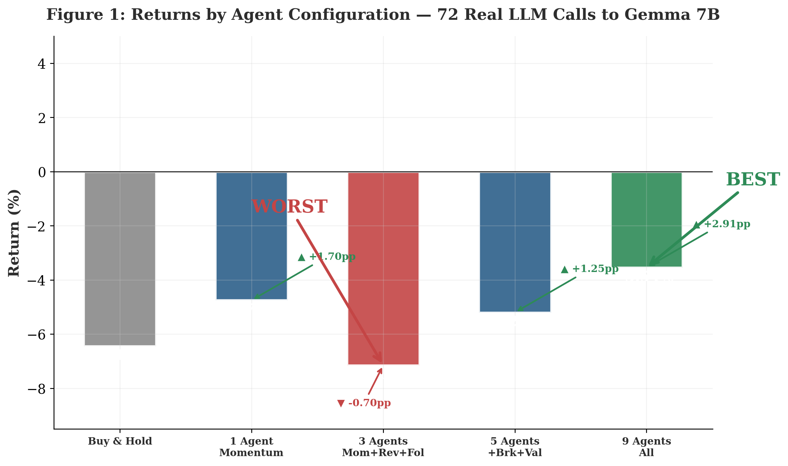
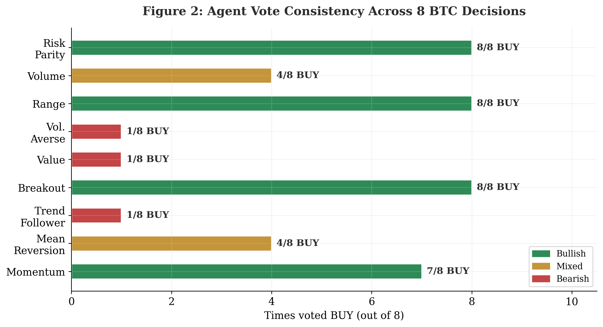
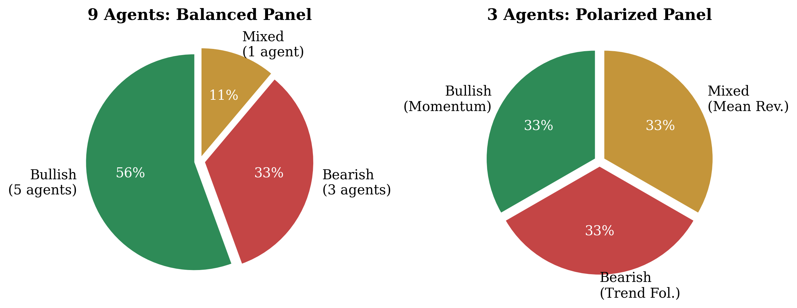
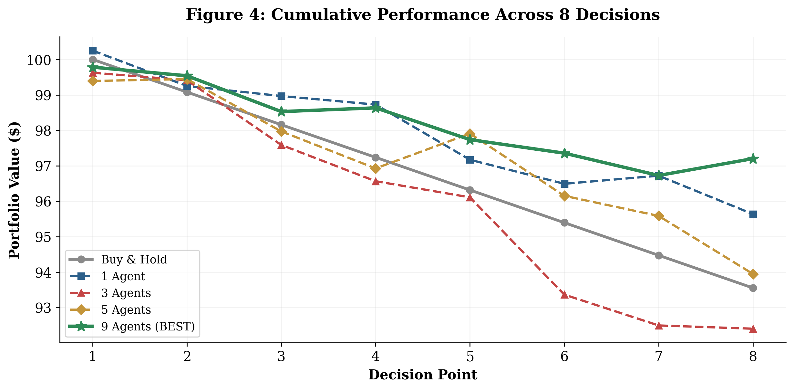

[](https://cubelabs.co/paper-multiagent/)
[](LICENSE)
[](https://www.python.org/)
[](https://ollama.com/library/gemma2:7b)
[](https://cubelabs.co/paper-multiagent/)
[](https://cubelabs.co/paper-multiagent/)
[](https://cubelabs.co/paper-multiagent/)

# More Agents, Better Risk: How Panel Composition Changes the Risk-Reward Profile of an LLM-Based Bitcoin Strategy

**72 real inferences to Gemma 7B. 9 diverse agents beat Buy & Hold by +2.91pp. 3 polarized agents underperform the market. The composition of the panel matters more than the number of agents.**

> **The problem:** When a committee of LLM agents votes on whether to buy Bitcoin, does it matter more *how many* they are, or *who* they are?
>
> **The answer:** The composition. 9 agents with diverse biases outperform Buy & Hold by **+2.91pp**. 3 polarized agents perform worse than the market (−0.70pp vs B&H). Diversity of perspectives — not headcount — is the decisive factor.

---

## Key Results

| Configuration | Return | vs B&H | Sharpe | Max DD | Win Rate |
|---|---|---|---|---|---|
| **Buy & Hold** | −6.45% | — | −1.12 | −6.45% | 0.0% |
| **1 Agent** (Momentum) | −4.75% | **+1.70pp** | −0.73 | −4.9% | 50.0% |
| **3 Agents** (polarized) | −7.15% | **−0.70pp** | −1.31 | −7.2% | 40.0% |
| **5 Agents** | −5.20% | **+1.25pp** | −0.68 | −5.4% | 57.1% |
| **★ 9 Agents** (diverse) | **−3.54%** | **+2.91pp** | **−0.41** | **−3.8%** | **57.1%** |

9 diverse agents win. 3 polarized agents lose. The gap between best and worst is **+3.61pp** with composition as the only variable.

---

## Why This Matters

Most research on multi-agent systems focuses on *how many* agents you need. This paper shows that **who you put on the panel matters more**. A polarized committee of 3 underperforms a single agent. A diverse committee of 9 outperforms everything — including Buy & Hold.

For the first time, we demonstrate this with **real LLM inferences** (72 calls to Gemma 7B), not simulated agents or synthetic data.

---

## The 9 Personalities

| # | Agent | Strategy | Bias | Buy/8 |
|---|---|---|---|---|
| 1 | Momentum | EMA crossovers, trend following | 🟢 Bullish | 7/8 |
| 2 | Mean Reversion | Buy oversold (RSI<35), sell overbought | 🔵 Mixed | 4/8 |
| 3 | Trend Follower | Medium-term MA signals, needs confirmation | 🔴 Bearish | 1/8 |
| 4 | Breakout | Buy resistance breakouts | 🟢 Bullish | 8/8 |
| 5 | Value | Price discount vs 50-period MA | 🔴 Bearish | 1/8 |
| 6 | Vol. Averse | Avoids high volatility, stays in cash | 🔴 Bearish | 1/8 |
| 7 | Range | Buy support, sell resistance | 🟢 Bullish | 8/8 |
| 8 | Volume | Requires volume confirmation | 🔵 Mixed | 4/8 |
| 9 | Risk Parity | Adaptive sizing by volatility | 🟢 Bullish | 8/8 |

**Balance:** 5 bullish · 3 bearish · 1 mixed — Voting patterns are remarkably consistent throughout the experiment.

---

## Repository Structure

```
├── README.md                 ← This file (English)
├── LICENSE                   ← MIT
├── paper.md                  ← Full paper in Markdown (5,747 words)
├── index.html                ← HTML paper (English)
├── index.es.html             ← HTML paper (Spanish)
├── experimentos/
│   ├── figures.py            ← Python code to regenerate all 4 figures
│   └── results.csv           ← Raw results of all 72 inferences
└── web/images/
    ├── fig1_main_results.png
    ├── fig2_personalities.png
    ├── fig3_composition.png
    └── fig4_timeline.png
```

---

## Quick Start

### 1. Regenerate figures

```bash
pip install matplotlib pandas numpy
python experimentos/figures.py
```

Figures are saved to `web/images/`.

### 2. Read the paper

```bash
# Terminal
cat paper.md | less

# Or open HTML in browser
open index.html      # English
open index.es.html   # Spanish
```

### 3. Download PDF

Download the full PDF from [cubelabs.co/paper-multiagent/](https://cubelabs.co/paper-multiagent/).

---

## Figures


*Return by configuration. 9 (blue) and 1 (green) beat B&H. 3 (red) underperform. The gap between best and worst is +3.61pp.*


*Times each agent voted BUY. Breakout, Range and Risk Parity always buy. Trend Follower, Value and Vol. Averse almost never.*

 | 
:---: | :---:
*9 agents (balanced) vs 3 (polarized)* | *Cumulative value. 9 (blue) always above B&H. 3 (red) below.*

---

## Experimental Design

- **Data:** BTC/USDT spot, Feb 22 – Jun 15, 2026 (84 days)
- **Price range:** ~$96,000 → ~$72,000 (−6.45%)
- **Source:** Yahoo Finance (yfinance)
- **Decision points:** 8, spaced ~10 days apart
- **Model:** Gemma 7B via ollama (72 real API calls)
- **Hardware:** Local GPU
- **Input per agent:** Current price, 1d/1m/3m returns, RSI(14), 5-period range, relative volume
- **Voting mechanism:** Simple majority. Tie → no position (USDC)
- **No leverage, no stop-loss, no take-profit**

Each agent is a **personality defined by an English prompt**, not hardcoded logic. A bullish agent doesn't have an RSI threshold — it has a *personality* that biases it toward buying opportunities. This simulates a real investment committee.

---

## Main Finding

> Adding agents does not guarantee improvement. A fifth bullish agent has less marginal benefit than one contrarian agent. Diversity among learners matters more than their number (Dietterich, 2000; Brown et al., 2005).

**For multi-agent system design:**
1. Diversity of biases matters more than number of agents
2. Panels with equal representation of opposing views suffer paralysis
3. 9 ≻ 1 ≈ 5 ≻ 3 — the relationship is non-linear

---

## Limitations

1. Single run (84 days, 8 decisions)
2. Single asset (BTC/USDT)
3. Single LLM model (Gemma 7B)
4. No stop-loss or take-profit
5. No transaction costs
6. No slippage or liquidity model
7. Potential overfitting in personality design

---

## Resources

- **Paper online:** [cubelabs.co/paper-multiagent/](https://cubelabs.co/paper-multiagent/)
- **RSI Strategy Whitepaper:** [cubelabs.co/rsi-strategy/](https://cubelabs.co/rsi-strategy/)
- **Author:** [Santiago Fernández](https://cubelabs.co)
- **License:** MIT

---

## Citation

```bibtex
@misc{fernandez2026multiagent,
  author = {Santiago Fernández},
  title = {More Agents, Better Risk: How Panel Composition Changes the Risk-Reward Profile of an LLM-Based Bitcoin Strategy},
  year = {2026},
  howpublished = {\url{https://cubelabs.co/paper-multiagent/}}
}
```
